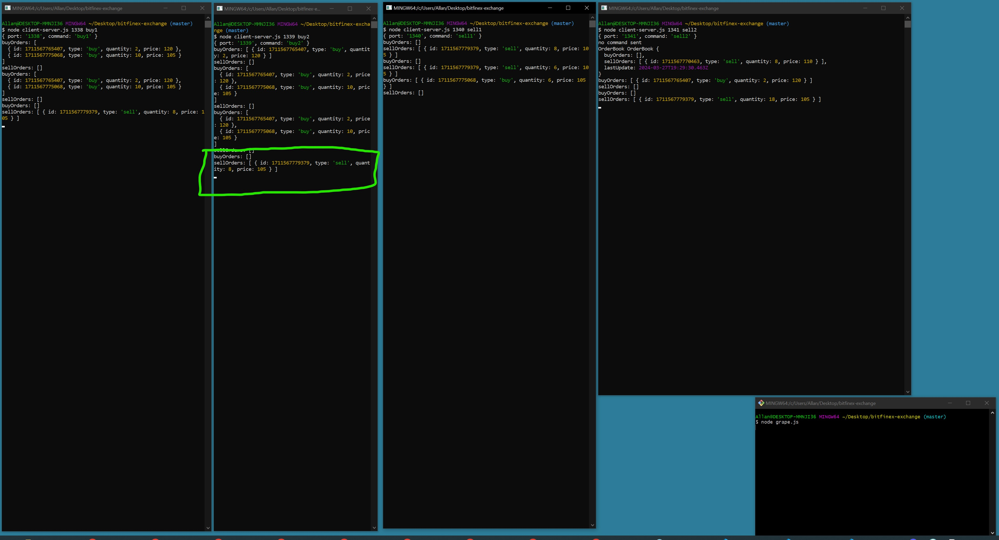

# About the test for the node blockchain.

In the current state, the nodes can be unsynced at some point in time.

Things that could be added:

1. Users: With the concept of wallet and fiat currencies. With a way to deposit/withdraw.
2. Wallet: The traders would be based on the asset/users. And it would need to exchange something, instead of just "processing" the trade, like it is doing now, with no consequences to values/checkings.
3. Security: There is no way to guarantee the security of the nodes itself, it could be changed to have inconsistencies.
4. Error handling: Handling gracefully some errors while trying to do trades and checking the errors from the communication with Grape/Grenache itself.

## To run the nodes

Run these commands to be able to run the nodes:

OBS

1. Run one terminal for each command
2. Wait 2~3 seconds between every command

```shell
yarn && node grape.js
```

```shell
node client-server.js 1339 buy2
```

```shell
node client-server.js 1341 sell2
```

```shell
node client-server.js 1338 buy1
```

```shell
node client-server.js 1340 sell1
```

This should be the order and the expected result on the orderbook:

1.

```
order: {
    type: "buy",
    quantity: 10,
    price: 120,
}


buyOrders: [ { id: ..., type: 'buy', quantity: 10, price: 120 } ]
sellOrders: []
```

2.

```
order: {
    type: "sell",
    quantity: 8,
    price: 110,
}


buyOrders: [ { id: ..., type: 'buy', quantity: 2, price: 120 } ]
sellOrders: []
```

3.

```
order: {
    type: "buy",
    quantity: 10,
    price: 105,
}


buyOrders: [
  { id: ..., type: 'buy', quantity: 2, price: 120 },
  { id: ..., type: 'buy', quantity: 10, price: 105 }
]
sellOrders: []
```

4.

```
order: {
    type: "sell",
    quantity: 20,
    price: 105,
}


buyOrders: []
sellOrders: [ { id: ..., type: 'sell', quantity: 8, price: 105 } ]
```

So the last result for the orderbook should be:

```
buyOrders: []
sellOrders: [ { id: ..., type: 'sell', quantity: 8, price: 105 } ]
```

This won't be the console for every node, but it will work the next time the client try to do something on the orderbook (usually will be to add another order).
There is a screenshot with the nodes running.


